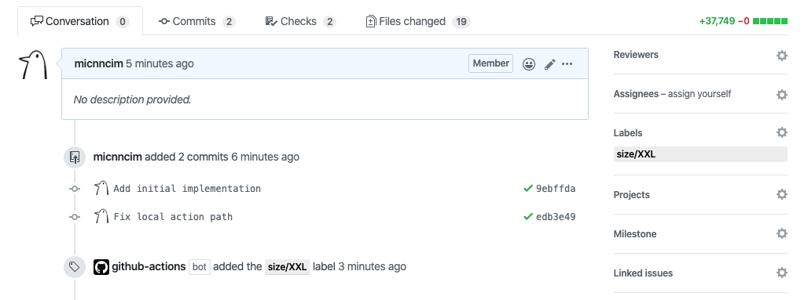
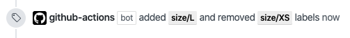

[](https://docs.stepsecurity.io/actions/stepsecurity-maintained-actions)

# Action Size




Determine a label to be added based on the number of lines changed in a pull request.

Counts the number of lines changed in a pull request.
And buckets this number into a few size classes (S, L, XL, etc).

It would be better to work with other actions which add and remove labels.
See [the example below](#example) for detail.

This action is inspired by [Kubernetes Prow's size plugin](https://prow.k8s.io/plugins).

## Note

GitHub API implicitly creates a label when it will add the label to an issue or a pull request but the label doesn't exists.
The label has the default color and no description.

If you don't prefer the default label, it's better to create labels indicating a pull request size.

## Inputs

All the inputs are optional.

### Size labels

The inputs `size_${size}_label` indicates what name each label has.

|         NAME         |         DESCRIPTION          |   TYPE   | REQUIRED |  DEFAULT   |
|----------------------|------------------------------|----------|----------|------------|
| `size_xs_label`      | The name for size XS label.  | `string` | `false`  | `size/XS`  |
| `size_s_label`       | The name for size S label.   | `string` | `false`  | `size/S`   |
| `size_m_label`       | The name for size M label.   | `string` | `false`  | `size/M`   |
| `size_l_label`       | The name for size L label.   | `string` | `false`  | `size/L`   |
| `size_xl_label`      | The name for size XL label.  | `string` | `false`  | `size/XL`  |
| `size_xxl_label`     | The name for size XXL label. | `string` | `false`  | `size/XXL` |

### Size thresholds

The inputs `size_${size}_threshold` indicates how many lines changed is corresponding to each label.
Must be a minimal number, rather than a range.

|         NAME         |         DESCRIPTION          |   TYPE   | REQUIRED |  DEFAULT   |
|----------------------|------------------------------|----------|----------|------------|
| `size_s_threshold`   | The threshold for size S.    | `number` | `false`  | `10`       |
| `size_m_threshold`   | The threshold for size M.    | `number` | `false`  | `30`       |
| `size_l_threshold`   | The threshold for size L.    | `number` | `false`  | `100`      |
| `size_xl_threshold`  | The threshold for size XL.   | `number` | `false`  | `500`      |
| `size_xxl_threshold` | The threshold for size XXL.  | `number` | `false`  | `1000`     |

## Outputs

|      NAME      |                                                                          DESCRIPTION                                                                           |   TYPE   |
| -------------- | -------------------------------------------------------------------------------------------------------------------------------------------------------------- | -------- |
| `new_label`    | The new label's name to be added. If there's no label to be added, it the value is `''`.                                                                       | `string` |
| `stale_labels` | The stale labels' name to be removed. If there're multiple labels, they're separated by line breaks. If there's no labels to be removed, it the value is `''`. | `string` |

## Example

This action works well with [step-security/action-add-labels](https://github.com/step-security/action-add-labels) and [step-security/action-remove-labels](https://github.com/step-security/action-remove-labels).

```yaml
name: Size

on:
  pull_request:
    types: [opened, synchronize]

jobs:
  update_labels:
    runs-on: ubuntu-latest
    steps:
      - uses: actions/checkout@v6

      - uses: step-security/action-size@v2
        id: size

      - uses: step-security/action-remove-labels@v1
        with:
          github_token: ${{ secrets.github_token }}
          labels: ${{ steps.size.outputs.stale_labels }}

      - uses: step-security/action-add-labels@v1
        with:
          github_token: ${{ secrets.github_token }}
          labels: ${{ steps.size.outputs.new_label }}
```

## License

Copyright 2020 The Actions Ecosystem Authors.

Copyright 2026 StepSecurity

Action Size is released under the [Apache License 2.0](./LICENSE).
